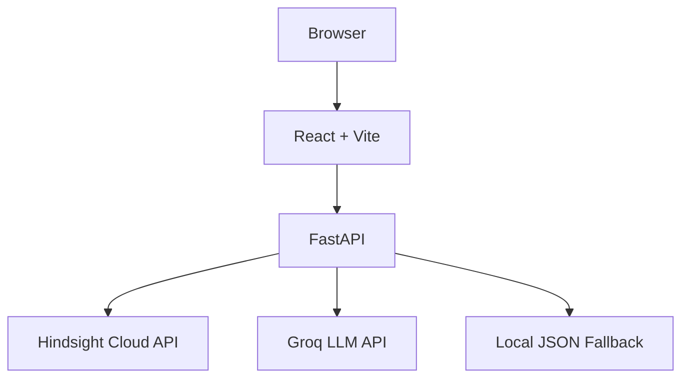
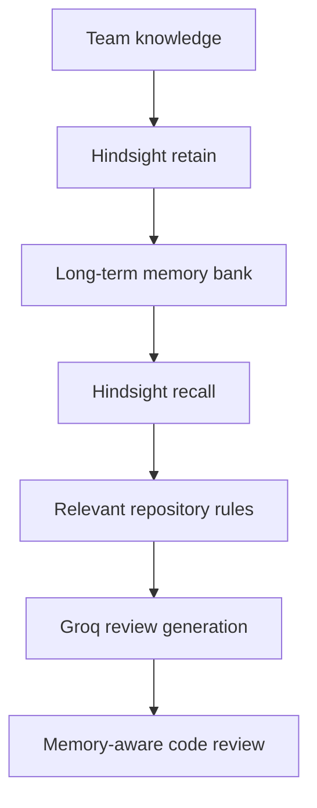

# RepoMind

### The Self-Evolving Code Review Agent

RepoMind is an AI code-review agent that **learns and remembers how a specific engineering team builds software**, using [Hindsight](https://hindsight.vectorize.io/) long-term memory as its core, non-negotiable differentiator.

> "RepoMind doesn't just review code. It remembers how your team builds software."

---

## Table of Contents

1. [Overview](#1-overview)
2. [The Problem](#2-the-problem)
3. [Why Stateless AI Reviewers Fail](#3-why-stateless-ai-reviewers-fail)
4. [The Solution](#4-the-solution)
5. [Why Hindsight Is Central](#5-why-hindsight-is-central)
6. [Architecture](#6-architecture)
7. [Memory Lifecycle](#7-memory-lifecycle)
8. [Tech Stack](#8-tech-stack)
9. [Repository Structure](#9-repository-structure)
10. [Environment Setup](#10-environment-setup)
11. [Hindsight Setup](#11-hindsight-setup)
12. [Groq Setup](#12-groq-setup)
13. [Installation](#13-installation)
14. [Running the Backend](#14-running-the-backend)
15. [Running the Frontend](#15-running-the-frontend)
16. [API Documentation](#16-api-documentation)
17. [Fallback Behavior](#17-fallback-behavior)
18. [Demo Instructions](#18-demo-instructions)
19. [The 60-Second Pitch](#19-the-60-second-pitch)
20. [How RepoMind Uses Hindsight (for judges)](#20-how-repomind-uses-hindsight-for-judges)
21. [Hackathon Submission Checklist](#21-hackathon-submission-checklist)
22. [Demo Video Checklist](#22-demo-video-checklist)
23. [Content Guide Challenge Mapping](#23-content-guide-challenge-mapping)
24. [Article / Social Media Content Outline](#24-article--social-media-content-outline)

---

## 1. Overview

Traditional AI code reviewers are mostly **stateless**: they review the diff in front of them but forget everything the moment the request ends. RepoMind is built around the opposite idea — every review, every reviewer correction, and every taught convention becomes part of a durable, queryable, institutional memory that makes the *next* review better.

## 2. The Problem

RepoMind solves two real engineering problems:

**Problem 1 — PR bottlenecks and reviewer fatigue.** Senior engineers repeatedly spend time reviewing the same architectural mistakes, the same security mistakes, the same database mistakes, the same logging mistakes, and repository-specific conventions that never seem to stick.

**Problem 2 — The stateless AI reviewer.** A generic AI reviewer understands general best practices, but it doesn't know *why this repository* uses a particular architecture, *what this team* decided last quarter, *what a senior engineer* corrected last month, or *which conventions are mandatory* here and only here.

## 3. Why Stateless AI Reviewers Fail

A stateless reviewer re-derives the same generic advice ("use parameterized queries") on every single PR, forever, without ever learning that *this* team's actual rule is "all database access goes through `repository/db.py`." It cannot cite team-specific precedent, cannot improve after a correction, and treats every repository identically regardless of its real conventions.

## 4. The Solution

RepoMind closes the loop:

```
Review → Learn → Remember → Recall → Review better → Learn more
```

A senior engineer (or the team collectively) **teaches** RepoMind a convention once. RepoMind **retains** it in Hindsight. On every future review, RepoMind **recalls** the conventions relevant to that specific diff and explicitly cites which memory drove which recommendation. The system becomes more useful the more the team uses it — this is the entire value proposition.

## 5. Why Hindsight Is Central

Hindsight is not used as a database. It is used exactly as intended — as a long-term memory system with automatic fact extraction, semantic recall, and entity/temporal linking:

- **Retain**: `POST /v1/default/banks/{bank_id}/memories` — RepoMind sends the raw natural-language convention; Hindsight extracts and stores it as structured memory.
- **Recall**: `POST /v1/default/banks/{bank_id}/memories/recall` — RepoMind sends the PR title + diff as a semantic query; Hindsight returns the team memories most relevant to *this specific code*, not a keyword match.
- Every recalled memory is surfaced in the UI and explicitly cited in the review text ("Memory used: ...") so the judge can see, in real time, that the recommendation is driven by remembered team knowledge — not a generic LLM guess.

See [§20](#20-how-repomind-uses-hindsight-for-judges) for the full breakdown judges should read.

## 6. Architecture



Memory flow:



## 7. Memory Lifecycle

1. A team teaches RepoMind a convention via the **Teach Hindsight** card.
2. RepoMind calls Hindsight's `retain` endpoint, which extracts structured facts from the natural-language rule and stores them in the team's memory bank.
3. On the next review, RepoMind calls Hindsight's `recall` endpoint with the PR title + diff as the query.
4. The most semantically relevant memories are returned and injected into the LLM's context window.
5. The LLM (Groq) applies those memories to the specific code and explicitly cites which memory justified which finding.
6. The review response returns the cited memories back to the UI, so the improvement is visible, not just asserted.
7. Additional reviewer corrections can be taught the same way, growing the bank over time.
8. Over weeks of use, the bank becomes an institutional engineering knowledge layer specific to that repository/team — something no stateless reviewer can ever build.

## 8. Tech Stack

**Backend:** Python 3.10+, FastAPI, Uvicorn, Pydantic, python-dotenv, httpx, Groq SDK
**Memory:** Hindsight Cloud REST API (`https://api.hindsight.vectorize.io`), with a persistent local JSON fallback
**Frontend:** React 18, Vite, Tailwind CSS, lucide-react

## 9. Repository Structure

```
repomind/
├── backend/
│   ├── main.py                  # FastAPI app + all endpoints
│   ├── memory_providers.py      # Hindsight + local fallback memory layer
│   ├── llm_service.py           # Groq service + deterministic local review engine
│   ├── requirements.txt
│   └── .env.example
├── frontend/
│   ├── package.json
│   ├── vite.config.js
│   ├── tailwind.config.js
│   ├── postcss.config.js
│   ├── index.html
│   └── src/
│       ├── main.jsx
│       ├── App.jsx
│       └── index.css
├── .gitignore
└── README.md
```

## 10. Environment Setup

Copy the example env file and fill in what you have. **Both integrations are optional** — RepoMind runs a complete demo with zero credentials via its fallback providers.

```bash
cp backend/.env.example backend/.env
```

## 11. Hindsight Setup

1. Sign up at [ui.hindsight.vectorize.io](https://ui.hindsight.vectorize.io/).
2. Redeem hackathon credits with promo code `MEMHACK99` inside Hindsight Cloud's billing screen (do **not** hardcode this code anywhere in the app — it is a one-time account credit, not an API credential).
3. Open the **Connect** page and create an API key.
4. Set in `backend/.env`:
   ```
   HINDSIGHT_API_KEY=hsk_...your_key...
   HINDSIGHT_API_URL=https://api.hindsight.vectorize.io
   HINDSIGHT_BANK_ID=repomind-demo-team
   ```
5. Restart the backend. `/api/health` will report `"memory_mode": "HINDSIGHT CONNECTED"` once Hindsight is reachable.

If you skip this step, RepoMind automatically uses `LocalMemoryProvider`, a persistent JSON-backed store with the exact same retain/recall/list interface, so the demo flow is identical either way — the UI will honestly report `"DEMO MEMORY MODE"` instead of claiming a Hindsight connection it doesn't have.

## 12. Groq Setup

1. Get an API key at [console.groq.com](https://console.groq.com/).
2. Set in `backend/.env`:
   ```
   GROQ_API_KEY=gsk_...your_key...
   GROQ_MODEL=llama-3.3-70b-versatile
   ```
3. If your account doesn't have access to that model, RepoMind automatically retries `openai/gpt-oss-120b`, then `qwen/qwen3-32b`, before falling back to the local pattern-based reviewer. Nothing crashes if a model name is wrong.

Without a Groq key, RepoMind uses a deterministic, pattern-based local review engine (SQL injection, unsafe interpolation, repository-pattern violations, `print()`/`console.log()`, sensitive logging, missing async error handling) that still demonstrates the memory-vs-no-memory difference — clearly labeled in the UI as the fallback engine.

## 13. Installation

```bash
# Backend
cd backend
python3 -m venv .venv && source .venv/bin/activate
pip install -r requirements.txt

# Frontend
cd ../frontend
npm install
```

## 14. Running the Backend

```bash
cd backend
uvicorn main:app --reload --port 8000
```

Health check: `curl http://localhost:8000/api/health`

## 15. Running the Frontend

```bash
cd frontend
npm run dev
```

Open `http://localhost:5173`. The Vite dev server proxies `/api/*` to `http://localhost:8000` (see `vite.config.js`).

## 16. API Documentation

Interactive Swagger docs are auto-generated by FastAPI at `http://localhost:8000/docs`.

| Method | Path | Description |
|---|---|---|
| GET | `/api/health` | Reports memory provider (`hindsight`/`local`), Hindsight connectivity, Groq configuration, and current memory count |
| POST | `/api/review` | Runs a code review. `bypass_memory: true` skips Hindsight entirely (stateless mode) |
| POST | `/api/teach` | Persists a new engineering convention via Hindsight/local `retain` |
| GET | `/api/memories` | Lists normalized memories for the UI |
| POST | `/api/seed` | Idempotent-ish seeding of 5 starter engineering conventions |

**`POST /api/review` request:**
```json
{ "code_diff": "...", "pr_title": "...", "bypass_memory": false }
```

**`POST /api/review` response:**
```json
{
  "review": "...",
  "memories": [ { "id": "...", "content": "...", "category": "database", "source": "seed" } ],
  "memory_count": 3,
  "groq_latency_ms": 420,
  "memory_enabled": true,
  "memory_provider": "hindsight"
}
```

## 17. Fallback Behavior

RepoMind is built so **a missing credential never breaks the demo**:

| Component | Configured | Missing / fails |
|---|---|---|
| Memory | `HindsightMemoryProvider` — real Hindsight Cloud REST calls | `LocalMemoryProvider` — persistent JSON store, same interface |
| LLM | Groq (`llama-3.3-70b-versatile`, with automatic fallback to `openai/gpt-oss-120b` / `qwen/qwen3-32b`) | Deterministic local pattern-based review engine |

The UI never lies about this: `/api/health` reports `HINDSIGHT CONNECTED` vs `DEMO MEMORY MODE`, and `GROQ READY` vs the local-engine label, and every review response includes `llm_provider` / `memory_provider` so it's always clear what actually generated the result.

## 18. Demo Instructions

1. `POST /api/seed` (or click **Seed memories** in the left panel) to prepopulate the team's engineering conventions.
2. Select the **Raw SQL Vulnerability** preset.
3. Click **Review Without Memory** → generic finding, no team context.
4. Click **Review With Hindsight** → the same code now cites a specific recalled team rule ("Memory used: ...").
5. Open **Teach Hindsight**, enter a new convention, click **Teach Hindsight** → "✓ Memory retained".
6. Run **Review With Hindsight** again → the newly taught rule now appears in the recalled memories and influences the review.
7. Use **Compare Reviews** any time to run both modes side by side concurrently.

## 19. The 60-Second Pitch

**0–10s:** "Most AI code reviewers understand code, but they don't remember how your team works."
**10–20s:** Load *Raw SQL Vulnerability*. Click **Review Without Memory**. Show the generic recommendation.
**20–35s:** Click **Review With Hindsight**. Show the repository-specific database rule being recalled and cited.
**35–45s:** Open **Teach Hindsight**, teach a new convention.
**45–55s:** Run the review again. Show the newly learned convention now shaping the output.
**55–60s:** "RepoMind doesn't just review code. It remembers how your team builds software."

## 20. How RepoMind Uses Hindsight (for judges)

1. **A team teaches a convention** through the Teach Hindsight card (or the `/api/seed` starter set).
2. **RepoMind stores it using Hindsight's `retain`** endpoint (`POST /v1/default/banks/{bank_id}/memories`), which performs automatic fact extraction rather than storing raw text as a blob.
3. **During a future review, RepoMind recalls relevant memories** using Hindsight's `recall` endpoint (`POST /v1/default/banks/{bank_id}/memories/recall`), querying with the PR title + diff so retrieval is semantic, not keyword-based.
4. **Relevant memories are passed to the review agent** (Groq) as explicit context in the system/user prompt.
5. **The agent applies those memories to the code** and is instructed to only cite a memory when it genuinely justifies a finding.
6. **The review cites the memory** verbatim in a `Memory used: "..."` line, and the recalled memories are also returned as structured data and rendered as pills in the UI — so the judge sees the causal link, not just a claim.
7. **Additional corrections can be remembered** the same way at any time, with no schema changes.
8. **Over time the memory becomes an institutional engineering knowledge layer** — this is the entire product, not a bolted-on feature. Hindsight is not used as a key-value cache; it is used for what it's built for: durable, semantically recallable, continuously growing agent memory.

## 21. Hackathon Submission Checklist

*(Preparation checklist — none of these are claimed as already submitted.)*

- [ ] GitHub repository pushed and public
- [ ] Clean, documented code (this repo)
- [ ] Demo video recorded (see §22)
- [ ] Live project demo ready (backend + frontend running, memories seeded)
- [ ] Explanation of Hindsight usage included (§20, this README)
- [ ] Article written
- [ ] Social media post drafted
- [ ] Required team-member content collected
- [ ] Screenshots / demo assets captured

## 22. Demo Video Checklist

Record, in order, staying close to 60 seconds if the submission format allows:

1. Product introduction (RepoMind + tagline)
2. The problem (stateless reviewers forget everything)
3. Stateless review (generic finding)
4. Hindsight review (team-specific finding, memory cited)
5. Memory recall visualization (pills + "Memory used")
6. Teach Hindsight (new convention persisted)
7. Improved subsequent review (new convention applied)

## 23. Content Guide Challenge Mapping

Challenge statement to be inserted from the official Content Guide.

## 24. Article / Social Media Content Outline

- **Hook:** "Your AI code reviewer forgets everything the moment the PR closes. What if it didn't?"
- **Problem:** reviewer fatigue + stateless AI reviewers re-teaching the same lessons forever
- **Demo:** stateless vs. Hindsight-augmented review, side by side
- **Twist:** teach it live, watch the next review change
- **Close:** "RepoMind doesn't just review code. It remembers how your team builds software."
- **CTA:** link to repo + Hindsight (`https://hindsight.vectorize.io/`)

---

## Security Notes

- No API keys are ever exposed to the frontend; all Hindsight/Groq calls happen server-side.
- CORS is wide open (`allow_origins=["*"]`) for hackathon convenience — restrict this before any real deployment.
- Request bodies are validated with Pydantic (length limits on diffs and rules).
- Diffs over 20,000 characters are rejected (`413`).
- Backend stack traces are never exposed to clients; errors are logged server-side and returned as clean JSON.
